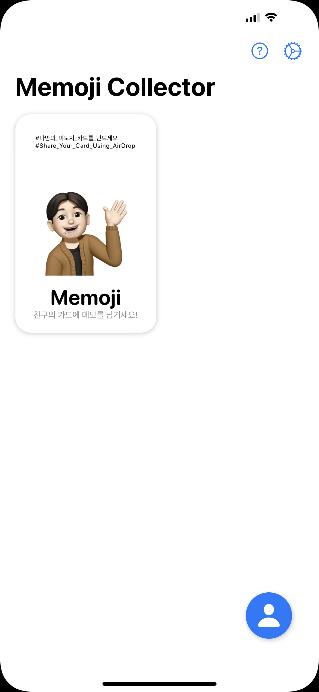
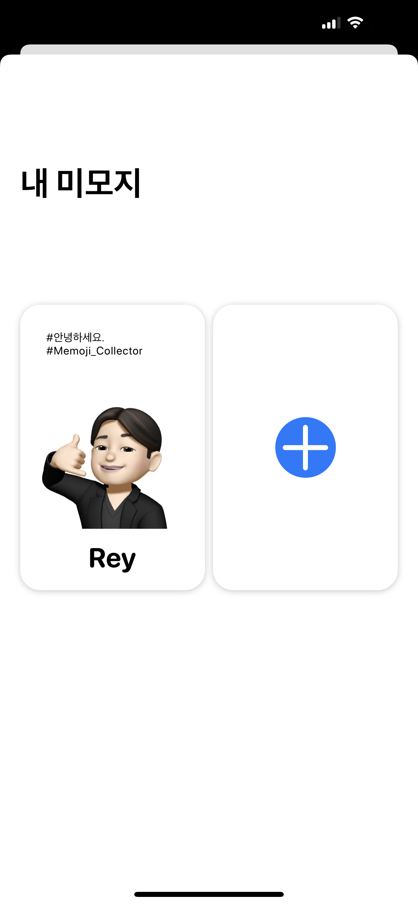

<h1 align="center">
     Memoji Collector
</h1>

2022.05.06 ~ 2022.05.06

[![Swift Version][swift-image]](https://swift.org/)
[![Platform][Platform-image]](https://developer.apple.com/kr/ios/)
![Version][Version-image]

[swift-image]:https://img.shields.io/badge/swift-5.6-orange.svg?style=flat
[Platform-image]: https://img.shields.io/badge/Platform-ios-lightgray.svg?style=flat
[Version-image]: https://img.shields.io/badge/Version-1.0-blue.svg?style=flat


<center>

| <div style="height:500px"> </div> | <div style="height:500px">  </div> | 
| - | - |   

</center>

# App Description
```
당신의 미모지를 공유하세요!
여러 사람들과 소통하고, 미모지를 교환하면서 내적 친밀감을 향상 시킬 수 있습니다!
```

# Requirments
- iOS 15.0+
- Xcode 13.0+

# Dependency
<table width=100%>
    <thead>
        <tr>
            <th><strong>Manager</strong></th>
            <th><strong>Dependecy</strong></th>
            <th><strong>Version</strong></th>
        </tr>
    </thead>
    <tbody>
        <tr>
            <td rowspan="5">Swift Package Manager</td>
            <td>Firebase(firebase-ios-sdk)</td>
            <td>8.9.1</td>
        </tr>
    </tbody>
</table>

# Features
## Project Structure
```
MemojiCollector
├── App
│   ├── AppDelegate.swift
│   ├── AppStorageKey.swift
│   └── MemojiCollectorApp.swift
├── CardView
│   ├── DeletedCardView.swift
│   ├── EmptyCardView.swift
│   ├── MakeCardView.swift
│   └── MemojiCardView.swift
├── Extension
│   ├── App+Extension.swift
│   └── View+Extension.swift
├── Manager
│   └── JsonManager.swift
├── Model
│   └── MemojiCardModel.swift
├── MyMemoji
│   ├── ActivityViewController.swift
│   ├── MakeMemojiCardView.swift
│   ├── MyMemojiView.swift
│   └── RegisterUserView.swift
├── ContentView.swift
├── GridCardView.swift
└── MemojiDetailView.swift
```

# API
## Document
[Firebase Cloud Storage](https://firebase.google.com/docs/storage/ios/start?hl=ko) 
